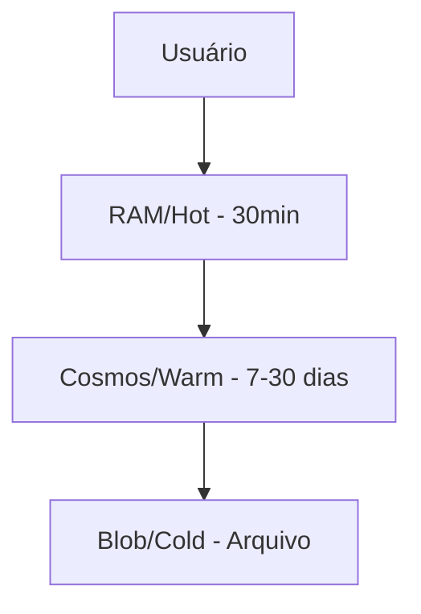

# 🤖 Bot Framework - Mesh Financial Analyst

[](https://meshbrain.azurewebsites.net)
[](https://www.python.org/)
[](https://meshbrain.azurewebsites.net/healthz)

## 📋 Visão Geral

Framework modular e escalável para criação de bots inteligentes com memória persistente, aprendizado contínuo e múltiplas interfaces de comunicação. Atualmente implementado como **Mesh**, um analista financeiro de BPO.

### 🚀 Status do Projeto

- **Fase 1**: ✅ Conexão Azure OpenAI + Web Apps (Concluída)
- **Fase 2**: ✅ Integração Teams via Azure Bot Service (Concluída - 17/09/2024)
- **Fase 3**: 🔄 Sistema de Memória Multi-Tier (Em Progresso)
- **Fase 4**: ⏸️ Sistema de Aprendizagem (Próximo)
- **Fase 5**: 📅 Skills Internas/Externas (Planejado)
- **Fase 6**: 📅 Testes Finais e Otimização (Futuro)

## 🏗️ Arquitetura

### Componentes Principais

```
bot-framework/
├── 🧠 core/           # Cérebro do bot e lógica principal
├── 💾 memory/         # Sistema de memória multi-tier
├── 🎯 skills/         # Habilidades e capacidades
├── 🔌 interfaces/     # Canais de comunicação
├── ⚙️ config/         # Configurações e settings
├── 🛠️ utils/          # Utilitários e helpers
└── 🧪 tests/          # Testes automatizados
```

### Sistema de Memória (3 Camadas)



- **HOT (RAM)**: Contexto imediato, acesso em microsegundos
- **WARM (Cosmos DB)**: Histórico recente, busca indexada
- **COLD (Blob Storage)**: Arquivo de longo prazo, comprimido

## 🔧 Instalação e Configuração

### Pré-requisitos

- Python 3.11+
- Azure Account (Cosmos DB, Blob Storage, OpenAI)
- Docker (opcional)
- Azure CLI

### 1. Configuração Local

```bash
# Clone o repositório
git clone https://github.com/seu-usuario/bot-framework.git
cd bot-framework

# Crie ambiente virtual
python -m venv .venv
source .venv/bin/activate  # Linux/Mac
# ou
.venv\Scripts\activate  # Windows

# Instale dependências
pip install -r requirements.txt

# Configure variáveis de ambiente
cp .env.example .env
# Edite .env com suas chaves Azure
```

### 2. Configuração Azure

```bash
# Login no Azure
az login

# Criar Cosmos DB
az cosmosdb create \
  --name "meshbrain-cosmos" \
  --resource-group "rg-wf-ia-gpt41" \
  --kind GlobalDocumentDB

# Criar Blob Storage
az storage account create \
  --name "meshbrainstorage" \
  --resource-group "rg-wf-ia-gpt41" \
  --sku Standard_LRS
```

### 3. Deploy

```bash
# Via script automático
./scripts/deploy.sh

# Ou via Docker
docker build -t meshbrain .
docker run -p 8000:8000 --env-file .env meshbrain

# Ou via Makefile
make deploy
```

## 🎮 Uso

### API REST

```bash
# Health Check
curl https://meshbrain.azurewebsites.net/healthz

# Enviar mensagem
curl -X POST https://meshbrain.azurewebsites.net/v1/messages \
  -H "Content-Type: application/json" \
  -d '{"user_id": "user123", "message": "Olá Mesh!"}'
```

### Microsoft Teams

1. Bot já está registrado no Azure Bot Service
2. Adicione o bot ao seu Teams
3. Converse naturalmente

### Endpoints Disponíveis

| Método | Endpoint | Descrição |
|--------|----------|-----------|
| GET | `/` | Root - informações básicas |
| GET | `/healthz` | Health check detalhado |
| GET | `/metrics` | Métricas Prometheus |
| POST | `/v1/messages` | Processar mensagem |
| POST | `/api/messages` | Bot Framework (Teams) |
| POST | `/v1/skills/{skill}` | Executar skill específica |

## 🧩 Skills Disponíveis

### Implementadas

- **api_caller**: Chamadas HTTP para APIs externas
- **report_generator**: Geração de relatórios HTML/PDF
- **image_generator**: Geração de imagens (desabilitado por padrão)

### Em Desenvolvimento

- **data_analyzer**: Análise de dados financeiros
- **document_processor**: Processamento de documentos
- **notification_sender**: Envio de notificações

## 🔐 Segurança

### Variáveis de Ambiente Necessárias

```env
# Azure OpenAI (Primário)
AZURE_OPENAI_ENDPOINT=https://seu-endpoint.openai.azure.com/
AZURE_OPENAI_KEY=sua-chave
AZURE_OPENAI_DEPLOYMENT=gpt-4o

# Claude (Fallback)
ANTHROPIC_API_KEY=sua-chave-anthropic

# Azure Cosmos DB
AZURE_COSMOS_ENDPOINT=https://seu-cosmos.documents.azure.com:443/
AZURE_COSMOS_KEY=sua-chave-cosmos

# Azure Blob Storage
AZURE_STORAGE_CONNECTION_STRING=sua-connection-string

# Teams Bot (se usar)
MICROSOFT_APP_ID=seu-app-id
MICROSOFT_APP_PASSWORD=sua-senha
```

## 📊 Monitoramento

### Health Check

```json
{
  "status": "ok",
  "bot": "Mesh",
  "provider_primary": "azure_openai",
  "provider_fallback": "claude",
  "memory": {
    "hot": "available",
    "warm": "available",
    "cold": "available"
  },
  "version": "1.0.0"
}
```

### Logs

```bash
# Azure App Service
az webapp log tail -n meshbrain -g rg-wf-ia-gpt41

# Local
tail -f logs/bot.log
```

## 🧪 Testes

```bash
# Testes unitários
pytest tests/

# Teste específico
pytest tests/test_memory.py -v

# Teste de integração com Cosmos
./scripts/test_cosmos.sh

# Coverage
pytest --cov=. tests/
```

## 🚀 Roadmap

### Q4 2024
- [x] Implementar memória multi-tier
- [ ] Sistema de aprendizagem básico
- [ ] Skills de integração Microsoft

### Q1 2025
- [ ] Busca semântica em memórias
- [ ] Interface web admin
- [ ] Multi-tenant support

### Q2 2025
- [ ] Integração com mais LLMs
- [ ] Sistema de plugins
- [ ] Analytics dashboard

## 🤝 Contribuindo

1. Fork o projeto
2. Crie sua feature branch (`git checkout -b feature/AmazingFeature`)
3. Commit suas mudanças (`git commit -m 'Add some AmazingFeature'`)
4. Push para a branch (`git push origin feature/AmazingFeature`)
5. Abra um Pull Request

## 📝 Convenções

- **Commits**: Use [Conventional Commits](https://www.conventionalcommits.org/)
- **Python**: Siga PEP 8
- **Docstrings**: Use Google Style
- **Testes**: Mínimo 80% coverage

## 🏛️ Arquitetura Técnica

### Padrões Utilizados

- **Strategy Pattern**: Para providers de LLM e storage
- **Factory Pattern**: Para criação de skills e providers
- **Singleton Pattern**: Para managers (config, memory)
- **Repository Pattern**: Para acesso a dados

### Tecnologias

- **Framework**: FastAPI
- **LLMs**: Azure OpenAI (principal), Anthropic Claude (fallback)
- **Storage**: Azure Cosmos DB, Azure Blob Storage
- **Logging**: structlog
- **Monitoring**: Prometheus metrics
- **Container**: Docker
- **CI/CD**: GitHub Actions (futuro)

## 📈 Performance

| Métrica | Valor |
|---------|-------|
| Tempo de resposta médio | < 2s |
| Uptime | 99.9% |
| Mensagens/minuto | 100+ |
| Custo/1000 msgs | ~$0.50 |

## 🐛 Troubleshooting

### Problema: Bot não responde

```bash
# Verificar health
curl https://meshbrain.azurewebsites.net/healthz

# Verificar logs
az webapp log tail -n meshbrain -g rg-wf-ia-gpt41
```

### Problema: Cosmos não conecta

```bash
# Verificar connection string
echo $AZURE_COSMOS_ENDPOINT
echo $AZURE_COSMOS_KEY

# Testar conexão
python scripts/test_cosmos.py
```

### Problema: Fallback não funciona

```bash
# Verificar Claude API key
echo $ANTHROPIC_API_KEY

# Testar fallback
curl -X POST https://meshbrain.azurewebsites.net/test/fallback
```

## 📞 Suporte

- **Issues**: [GitHub Issues](https://github.com/seu-usuario/bot-framework/issues)
- **Email**: suporte@wfinance.com.br
- **Teams**: Canal #mesh-bot-support

## 📜 Licença

Proprietary - WFinance © 2025

---

**Desenvolvido com ❤️ pela equipe WFinance**