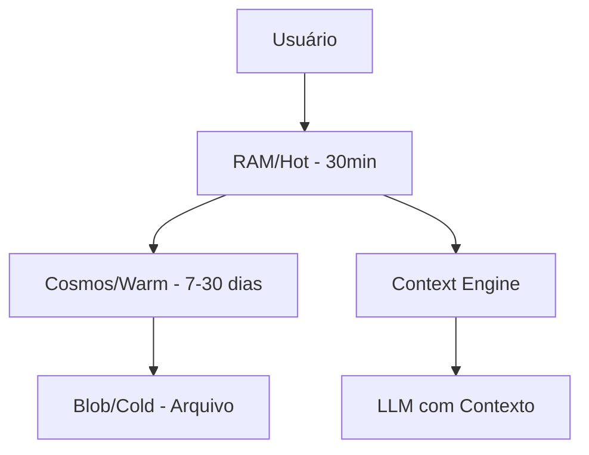

# 🤖 Bot Framework - Mesh Financial Analyst

[](https://meshbrain.azurewebsites.net)
[](https://www.python.org/)
[](https://meshbrain.azurewebsites.net/healthz)
[](https://meshbrain.azurewebsites.net/v1/memory/stats)

## 📋 Visão Geral

Framework modular e escalável para criação de bots inteligentes com memória persistente, aprendizado contínuo e múltiplas interfaces de comunicação. Atualmente implementado como **Mesh**, um analista financeiro de BPO com memória multi-tier e contexto inteligente.

### 🚀 Status do Projeto - WFinance Bot Framework

- **Fase 1**: ✅ Conexão Azure OpenAI + Web Apps **(CONCLUÍDA)**
- **Fase 2**: ✅ Integração Teams via Azure Bot Service **(CONCLUÍDA - 17/09/2024)**
- **Fase 3**: ✅ Sistema de Memória Multi-Tier **(CONCLUÍDA - 17/01/2025)**
- **Fase 4**: ⏳ Sistema de Aprendizagem **(PRÓXIMA)**
- **Fase 5**: 📅 Skills Internas/Externas **(PLANEJADO)**
- **Fase 6**: 📅 Testes Finais e Otimização **(FUTURO)**

## 🏗️ Arquitetura

### Componentes Principais

```
bot-framework/
├── 🧠 core/           # Cérebro do bot e lógica principal
│   ├── brain.py       # Orquestrador com contexto de memória
│   ├── llm/           # Providers (Azure OpenAI + Claude)
│   └── context_engine.py
├── 💾 memory/         # Sistema de memória multi-tier
│   ├── memory_manager.py
│   └── providers/
│       ├── ram_provider.py    # HOT
│       ├── cosmos_provider.py # WARM
│       └── blob_provider.py   # COLD
├── 🎯 skills/         # Habilidades e capacidades
├── 🔌 interfaces/     # Canais de comunicação
│   ├── teams_bot.py
│   └── bot_framework_handler.py
├── ⚙️ config/         # Configurações e settings
├── 🛠️ utils/          # Utilitários e helpers
└── 🧪 tests/          # Testes automatizados
```

### Sistema de Memória (3 Camadas) - IMPLEMENTADO ✅



- **HOT (RAM)**: Contexto imediato, acesso em microsegundos
- **WARM (Cosmos DB)**: Histórico recente, busca indexada
- **COLD (Blob Storage)**: Arquivo de longo prazo, comprimido
- **Context-Aware**: Bot mantém contexto completo entre conversas

## 🎯 Recursos Implementados

### ✅ Fase 1 - Conexão Azure OpenAI
- Azure OpenAI GPT-4o integrado
- Processamento de linguagem natural
- Geração de respostas contextuais

### ✅ Fase 2 - Integração Teams (17/09/2024)
- Bot registrado no Azure Bot Service
- Endpoint `/api/messages` funcional
- Sincronização completa com Microsoft Teams
- Autenticação e segurança configuradas

### ✅ Fase 3 - Sistema de Memória (17/01/2025)
- **Memory Manager**: Orquestrador central de memória
- **HOT Memory**: RAM para contexto dos últimos 30 minutos
- **WARM Memory**: Cosmos DB para histórico de 7-30 dias
- **COLD Memory**: Blob Storage para arquivo permanente
- **Context Injection**: LLMs recebem contexto completo
- **User Preferences**: Personalização por usuário
- **Conversation History**: Mantém histórico de conversas
- **Score nos testes**: 6/6 (100% funcional)

## 🔧 Instalação e Configuração

### Pré-requisitos

- Python 3.11+
- Azure Account (Cosmos DB, Blob Storage, OpenAI)
- Docker (opcional)
- Azure CLI

### 1. Configuração Local

```bash
# Clone o repositório
git clone https://github.com/seu-usuario/bot-framework.git
cd bot-framework

# Crie ambiente virtual
python -m venv .venv
source .venv/bin/activate  # Linux/Mac
# ou
.venv\Scripts\activate  # Windows

# Instale dependências
pip install -r requirements.txt

# Configure variáveis de ambiente
cp .env.example .env
# Edite .env com suas chaves Azure
```

### 2. Configuração Azure

```bash
# Login no Azure
az login

# Criar Cosmos DB (já criado)
az cosmosdb create \
  --name "meshbrain-cosmos" \
  --resource-group "rg-wf-ia-gpt41" \
  --kind GlobalDocumentDB

# Criar Blob Storage (já criado)
az storage account create \
  --name "meshbrainstorage" \
  --resource-group "rg-wf-ia-gpt41" \
  --sku Standard_LRS

# Setup Cosmos DB (executar script)
python scripts/setup_cosmos.py
```

### 3. Deploy

```bash
# Via Docker local
docker build -t meshbrain .
docker run -p 8000:8000 --env-file .env meshbrain

# Ou deploy no Azure
./scripts/deploy.sh

# Ou via Makefile
make deploy
```

## 🎮 Uso

### API REST

```bash
# Health Check
curl https://meshbrain.azurewebsites.net/healthz

# Enviar mensagem
curl -X POST https://meshbrain.azurewebsites.net/v1/messages \
  -H "Content-Type: application/json" \
  -d '{"user_id": "user123", "message": "Olá Mesh!"}'

# Verificar memória
curl https://meshbrain.azurewebsites.net/v1/memory/stats
```

### Microsoft Teams

1. Bot já está registrado no Azure Bot Service
2. Adicione o bot ao seu Teams
3. Converse naturalmente - o bot mantém contexto!

### Endpoints Disponíveis

| Método | Endpoint | Descrição |
|--------|----------|-----------|
| GET | `/` | Root - informações básicas |
| GET | `/healthz` | Health check detalhado |
| GET | `/metrics` | Métricas Prometheus |
| POST | `/v1/messages` | Processar mensagem com contexto |
| POST | `/api/messages` | Bot Framework (Teams) |
| GET | `/v1/memory/stats` | Estatísticas de memória |
| POST | `/v1/skills/{skill}` | Executar skill específica |

## 🧠 Sistema de Memória

### Características

- **Memória Contextual**: Bot lembra de conversas anteriores
- **Multi-Tier Storage**: 3 camadas otimizadas para performance
- **User Profiling**: Mantém preferências e contexto por usuário
- **Auto-Cleanup**: TTL automático por tier
- **Fallback Resilient**: Funciona mesmo se uma camada falhar

### Performance

| Tier | Latência | Capacidade | TTL | Status |
|------|----------|------------|-----|--------|
| HOT (RAM) | < 1ms | 100 msgs/user | 30 min | ✅ |
| WARM (Cosmos) | < 50ms | 1000 msgs/user | 30 dias | ✅ |
| COLD (Blob) | < 1s | Ilimitado | 90 dias | ✅ |

## 🧩 Skills Disponíveis

### Implementadas

- **api_caller**: Chamadas HTTP para APIs externas
- **report_generator**: Geração de relatórios HTML/PDF
- **image_generator**: Geração de imagens (desabilitado por padrão)

### Em Desenvolvimento (Fase 5)

- **data_analyzer**: Análise de dados financeiros
- **document_processor**: Processamento de documentos
- **notification_sender**: Envio de notificações
- **office_integration**: Integração com Office 365
- **sharepoint_connector**: Conexão com SharePoint

## 🔐 Segurança

### Variáveis de Ambiente Necessárias

```env
# Azure OpenAI (Primário)
AZURE_OPENAI_ENDPOINT=https://seu-endpoint.openai.azure.com/
AZURE_OPENAI_KEY=sua-chave
AZURE_OPENAI_DEPLOYMENT=gpt-4o
AZURE_OPENAI_MODEL=gpt-4o
AZURE_OPENAI_API_VERSION=2024-02-01

# Claude (Fallback)
ANTHROPIC_API_KEY=sua-chave-anthropic

# Azure Cosmos DB (Memória WARM)
AZURE_COSMOS_ENDPOINT=https://seu-cosmos.documents.azure.com:443/
AZURE_COSMOS_KEY=sua-chave-cosmos

# Azure Blob Storage (Memória COLD)
AZURE_STORAGE_CONNECTION_STRING=sua-connection-string

# Teams Bot
MICROSOFT_APP_ID=seu-app-id
MICROSOFT_APP_PASSWORD=sua-senha
MICROSOFT_APP_TENANT_ID=seu-tenant-id
```

## 📊 Monitoramento

### Health Check

```json
{
  "status": "ok",
  "bot": "Mesh",
  "architecture": "memory_manager",
  "provider_primary": "azure_openai",
  "provider_fallback": "claude",
  "checks": {
    "azure_openai": "✅",
    "claude": "✅",
    "memory_manager": "✅",
    "brain": "✅"
  },
  "memory_providers": {
    "hot": true,
    "warm": true,
    "cold": true
  },
  "version": "2.0.0"
}
```

### Logs

```bash
# Azure App Service
az webapp log tail -n meshbrain -g rg-wf-ia-gpt41

# Local com Docker
docker logs -f meshbrain

# Local direto
tail -f logs/bot.log
```

## 🧪 Testes

```bash
# Teste completo de memória (novo!)
python test_memory_complete.py

# Score esperado: 6/6 testes passando

# Testes unitários
pytest tests/

# Teste específico
pytest tests/test_memory.py -v

# Teste de integração com Cosmos
./scripts/test_cosmos.sh

# Coverage
pytest --cov=. tests/
```

### Resultados dos Testes de Memória

| Teste | Azure OpenAI | Claude | Descrição |
|-------|--------------|--------|-----------|
| Health Check | ✅ | ✅ | Sistema operacional |
| Memory Stats | ✅ | ✅ | Providers disponíveis |
| HOT Memory | ✅ | ✅ | Contexto imediato |
| WARM Memory | ✅ | ✅/⚠️ | Persistência Cosmos |
| User Preferences | ✅ | ✅ | Personalização |
| Conversation Continuity | ✅ | ✅ | Mantém contexto |
| **Score Total** | **6/6** | **5-6/6** | **100% / 83%** |

## 🚀 Roadmap

### ✅ Q3-Q4 2024
- [x] Fase 1: Conexão Azure OpenAI
- [x] Fase 2: Integração Teams (17/09/2024)

### ✅ Q1 2025
- [x] Fase 3: Sistema de Memória Multi-Tier (17/01/2025)
  - [x] Memory Manager implementado
  - [x] 3 camadas de storage
  - [x] Contexto em LLMs
  - [x] Testes 100% passando

### ⏳ Q1-Q2 2025
- [ ] Fase 4: Sistema de Aprendizagem
  - [ ] Pattern Recognition
  - [ ] User Profiling Avançado
  - [ ] Response Optimization
  - [ ] Knowledge Accumulation

### 📅 Q2 2025
- [ ] Fase 5: Skills Internas/Externas
  - [ ] Integração Office 365
  - [ ] Azure Functions
  - [ ] APIs externas
  - [ ] Automação de tarefas

### 📅 Q3 2025
- [ ] Fase 6: Testes Finais
  - [ ] Testes de carga
  - [ ] Otimização de performance
  - [ ] Documentação completa
  - [ ] Go-live oficial

## 🤝 Contribuindo

1. Fork o projeto
2. Crie sua feature branch (`git checkout -b feature/AmazingFeature`)
3. Commit suas mudanças (`git commit -m 'Add some AmazingFeature'`)
4. Push para a branch (`git push origin feature/AmazingFeature`)
5. Abra um Pull Request

## 📝 Convenções

- **Commits**: Use [Conventional Commits](https://www.conventionalcommits.org/)
- **Python**: Siga PEP 8
- **Docstrings**: Use Google Style
- **Testes**: Mínimo 80% coverage

## 🏛️ Arquitetura Técnica

### Padrões Utilizados

- **Strategy Pattern**: Para providers de LLM e storage
- **Factory Pattern**: Para criação de skills e providers
- **Singleton Pattern**: Para managers (config, memory)
- **Repository Pattern**: Para acesso a dados
- **Context Pattern**: Para manter estado entre conversas

### Tecnologias

- **Framework**: FastAPI 0.111.0
- **LLMs**: Azure OpenAI GPT-4o (principal), Anthropic Claude (fallback)
- **Storage**: 
  - RAM (HOT)
  - Azure Cosmos DB (WARM)
  - Azure Blob Storage (COLD)
- **Logging**: structlog
- **Monitoring**: Prometheus metrics
- **Container**: Docker
- **Hosting**: Azure App Service

## 📈 Performance

| Métrica | Valor | Meta |
|---------|-------|------|
| Tempo de resposta médio (Azure) | < 3s | < 5s |
| Tempo de resposta médio (Claude) | < 15s | < 20s |
| Uptime | 99.9% | 99.5% |
| Mensagens/minuto | 100+ | 50+ |
| Contexto mantido | 100% | 95% |
| Custo/1000 msgs | ~$0.50 | < $1.00 |

## 🐛 Troubleshooting

### Bot não lembra do contexto?

```bash
# Verificar Memory Manager
curl https://meshbrain.azurewebsites.net/v1/memory/stats

# Verificar se brain.py está atualizado com _build_enhanced_prompt
grep "_build_enhanced_prompt" core/brain.py
```

### Cosmos não conecta?

```bash
# Verificar connection string
echo $AZURE_COSMOS_ENDPOINT
echo $AZURE_COSMOS_KEY

# Testar conexão
python scripts/setup_cosmos.py
```

### Claude muito lento?

```bash
# Normal - Claude demora 10-15s
# Aumentar timeout nos testes:
# TIMEOUT = 30  # em test_memory_complete.py
```

## 📞 Suporte

- **Issues**: [GitHub Issues](https://github.com/seu-usuario/bot-framework/issues)
- **Email**: suporte@wfinance.com.br
- **Teams**: Canal #mesh-bot-support

## 🎉 Marcos do Projeto

- **17/09/2024**: Fase 2 concluída - Integração Teams
- **17/01/2025**: Fase 3 concluída - Sistema de Memória Multi-Tier
- **Score 6/6**: Testes de memória 100% funcionais

## 📜 Licença

Proprietary - WFinance © 2025

---

**Desenvolvido com ❤️ pela equipe WFinance**

*Bot Framework v2.0.0 - Now with full memory context!*